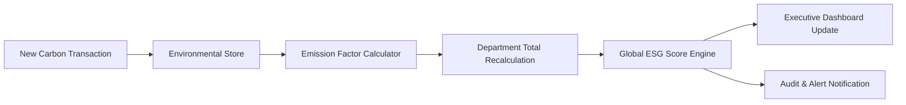
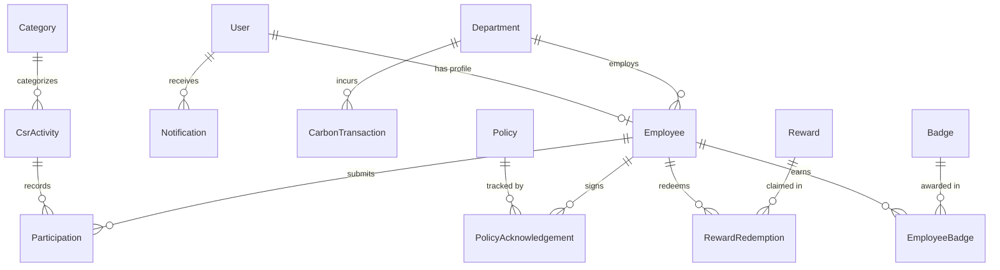

# 🌍 EcoSphere — Enterprise ESG Management Platform

<div align="center">

[](https://nextjs.org/)
[](https://react.dev/)
[](https://www.typescriptlang.org/)
[](https://tailwindcss.com/)
[](https://www.prisma.io/)
[](https://ai.google.dev/)
[](https://github.com/pmndrs/zustand)
[](LICENSE)

**An intelligent, enterprise-grade sustainability ERP unifying Environmental accounting, Social gamification, and Governance compliance with AI-powered analytics.**

[Key Features](#-key-features) • [Architecture](#-architecture--system-design) • [Tech Stack](#-tech-stack) • [Quick Start](#-quick-start--installation) • [Database Schema](#-database-schema) • [API Reference](#-api-reference) • [Roadmap](#-future-roadmap)

</div>

---

## 📌 Executive Overview

Enterprises globally face growing regulatory demands—from **SEBI BRSR (Business Responsibility and Sustainability Reporting)** in India to **EU CSRD** and **GRI Standards**. Yet, most organizations manage sustainability in fragmented spreadsheets, disconnected emails, and manual audits.

**EcoSphere** solves this $500B compliance challenge by delivering **"An ERP for Sustainability"**:
- 📉 **Eliminates Data Silos:** Consolidates Scope 1, 2, and 3 emissions, CSR initiatives, and governance audit trails into a single source of truth.
- ⚡ **Cascading Real-Time State:** Automatically updates global ESG scores and department rankings the moment a new carbon transaction or CSR proof is submitted.
- 🎮 **Gamification Engine:** Increases employee CSR engagement from an industry standard of 20% to over 80% with XP, automatic badge milestones, and a company reward redemption store.
- 🤖 **Context-Aware AI Copilot:** Powered by Google Gemini, turning raw transactional metrics into C-suite executive briefs, risk analyses, and regulatory disclosures in seconds.

---

## 🏗️ Architecture & System Design

EcoSphere is architected around a strict unidirectional data flow and clean separation of concerns, ensuring high performance, zero build warnings, and seamless extensibility.

```
┌─────────────────────────────────────────────────────────────────────────┐
│                           PRESENTATION LAYER                            │
│           Next.js 16 (App Router) • React 19 • Tailwind CSS v4          │
│         Recharts Data Visualizations • Lucide Icons • Sonner Toasts     │
├─────────────────────────────────────────────────────────────────────────┤
│                        REACTIVE STATE LAYER                             │
│                      Zustand Multi-Store Hub                            │
│  ┌───────────────┐ ┌───────────────┐ ┌───────────────┐ ┌─────────────┐  │
│  │ Environmental │ │ Social/Gamify │ │  Governance   │ │ Master Data │  │
│  └───────┬───────┘ └───────┬───────┘ └───────┬───────┘ └──────┬──────┘  │
│          └─────────────────┼─────────────────┘                │         │
│                            ▼                                  │         │
│                 ┌──────────────────────┐                      │         │
│                 │ ESG Score Calculator │                      │         │
│                 │ (Weighted E-S-G:40-30-30)                   │         │
│                 └──────────────────────┘                      │         │
├─────────────────────────────────────────────────────────────────────────┤
│                           API & AI SERVICES                             │
│       Next.js API Route Handlers • Google Gemini 2.0 Generative AI      │
│                     NextAuth.js RBAC Authentication                     │
├─────────────────────────────────────────────────────────────────────────┤
│                         PERSISTENCE & ORM                               │
│            Prisma ORM 5 • SQLite (Local) / PostgreSQL (Prod)            │
└─────────────────────────────────────────────────────────────────────────┘
```

### 🔄 Real-Time State Cascades



---

## ✨ Key Features

### 1. 📊 Executive ESG Command Center
- **Composite ESG Score Engine:** Computes an aggregated ESG score weighted dynamically:
  $$\text{ESG Score} = (\text{Environmental} \times 0.40) + (\text{Social} \times 0.30) + (\text{Governance} \times 0.30)$$
- **Real-Time KPI Matrices:** Instant insights into net carbon emissions ($t\text{CO}_2\text{e}$), active CSR initiatives, pending governance audits, and employee engagement scores.
- **Department Performance Leaderboards:** Automated scoring and rank benchmarks across Operations, Logistics, IT, HR, and Facility Management.
- **Active Compliance Alerts:** High, medium, and low-priority alerts linked directly to actionable governance workflows.

### 2. 🌿 Environmental Accounting & Carbon Footprint
- **Transaction Ledger:** Comprehensive logging of Scope 1 (direct fuels), Scope 2 (electricity/grid), and Scope 3 (travel, logistics) emissions.
- **Automated $\text{CO}_2\text{e}$ Engine:** Real-time conversion using configurable emission factors ($kWh \to t\text{CO}_2\text{e}$, liters $\to t\text{CO}_2\text{e}$, passenger-km $\to t\text{CO}_2\text{e}$).
- **Target Tracking & Progress Bars:** Visual trajectory monitoring against enterprise decarbonization milestones.
- **Emission Factor Library:** Centralized repository for EPA, CEA, and IPCC standardized conversion values.

### 3. 👥 Social Responsibility & Gamification Hub
- **CSR Activity Management:** Create, publish, and track company-wide social and environmental drives.
- **Participation Verification Workflow:** Employees submit proof of participation; managers review and approve with single-click audits.
- **XP Progression & Badges:** Gamified experience points unlock tier badges (*Eco Warrior*, *Carbon Buster*, *Green Pioneer*) automatically.
- **Rewards Catalog & Inventory:** Employee XP can be redeemed for sustainable merchandise, vouchers, and tree-planting pledges with real-time stock counters.
- **Diversity & Community Heatmap:** Visual tracking of gender ratio, training hours, and workplace safety incident rates.

### 4. ⚖️ Governance, Risk & Compliance (GRC)
- **Policy Lifecycle & Acknowledgement:** Digital policy distributor with individual employee acknowledgement status and automated overdue reminders.
- **Compliance Incident Tracker:** End-to-end incident lifecycle: `Open` $\to$ `Investigating` $\to$ `Resolved` with severity ratings and assigned officers.
- **Audit History & Trail:** Chronological timeline of external and internal regulatory audits (ISO 14001, ISO 45001, BRSR readiness).

### 5. 🤖 EcoSphere AI Copilot (Gemini 2.0 Flash)
- **In-Context ESG Intelligence:** Ingests live transactional data across all modules into context prompts.
- **One-Click Executive Presets:**
  - 📋 *Executive ESG Summary* — Board-ready sustainability overview.
  - 📉 *Carbon Trend Analysis* — Emission anomalies and Scope 1-3 breakdowns.
  - ⚠️ *Department Risk Assessment* — Non-compliance indicators and mitigation recommendations.
  - 💡 *Sustainability Action Plan* — AI recommendations aligned with Indian regulatory frameworks (SEBI, CPCB, MoEFCC, Companies Act 2013).
- **Graceful Fallback:** Built-in offline intelligent synthesis when running without active API keys.

### 6. 📈 Custom Report Builder & Analytics Studio
- **Multi-Dimensional Querying:** Filter by date ranges, departments, ESG categories, and personnel.
- **Global Metric Scorecards:** Deep dive into raw metrics, audit logs, and transaction tables.
- **Export Capabilities:** One-click structured export for compliance submissions (PDF/CSV ready).

### 7. ⚙️ Master Data & Business Rules Engine
- **Customizable Automation Rules:** Toggle automated emission calculations, mandatory receipt proof uploads, and auto-badge awarding.
- **CRUD Operations:** Full administration over Departments, Categories, Emission Factors, and Policies.

---

## 🛠️ Tech Stack

| Domain | Technology | Description |
|---|---|---|
| **Frontend Framework** | [Next.js 16 (App Router)](https://nextjs.org/) | Server and Client Components, optimized routing |
| **UI Library** | [React 19](https://react.dev/) | Concurrent rendering and modern hook architecture |
| **Language** | [TypeScript 5](https://www.typescriptlang.org/) | Strict type safety across UI, stores, and API layers |
| **Styling** | [Tailwind CSS v4](https://tailwindcss.com/) | Modern CSS engine with `@tailwindcss/postcss` |
| **State Management** | [Zustand 5](https://github.com/pmndrs/zustand) | Decoupled, reactive stores for cross-module synchronization |
| **ORM & Database** | [Prisma 5](https://www.prisma.io/) + SQLite / PostgreSQL | Type-safe database queries and automated migrations |
| **AI Integration** | [Google Generative AI](https://ai.google.dev/) (`@google/generative-ai`) | Gemini 2.0 Flash for low-latency contextual intelligence |
| **Data Visualization** | [Recharts 3](https://recharts.org/) | Responsive charts for emission trends and distributions |
| **Form Handling** | [React Hook Form](https://react-hook-form.com/) + [Zod](https://zod.dev/) | High-performance forms with schema validation |
| **UI Components** | [shadcn/ui](https://ui.shadcn.com/) + [Lucide Icons](https://lucide.dev/) | Clean, accessible, modern design primitives |
| **Notifications** | [Sonner](https://sonner.emilkowal.ski/) | Animated toast notification system |

---

## 📁 Repository Structure

```
EcoSphere-ESG-Management-Platform/
├── prisma/
│   ├── schema.prisma           # Prisma data models (13+ interconnected entities)
│   └── seed.ts                 # Database seeding script for initial demo data
├── public/                     # Static assets and brand icons
├── src/
│   ├── app/                    # Next.js App Router root
│   │   ├── ai/                 # AI Copilot Page
│   │   ├── api/                # Backend API Routes
│   │   │   ├── ai/chat/        # Gemini AI contextual chat endpoint
│   │   │   ├── auth/           # NextAuth authentication handlers
│   │   │   └── master-data/    # REST endpoints for master entities
│   │   ├── environmental/      # Environmental Carbon Accounting Page
│   │   ├── governance/         # Governance & Compliance Page
│   │   ├── reports/            # Custom Reports & Analytics Page
│   │   ├── settings/           # Business Rules & Master Data Admin Page
│   │   ├── social/             # Social CSR & Gamification Page
│   │   ├── globals.css         # Global styles and Tailwind v4 themes
│   │   ├── layout.tsx          # Root app layout wrapper
│   │   └── page.tsx            # Main Executive Dashboard
│   ├── components/
│   │   ├── shared/             # Reusable widgets (KPICards, SectionHeaders)
│   │   └── ui/                 # Accessible primitives (Buttons, Dialogs, Tables)
│   ├── layouts/
│   │   ├── MainLayout.tsx      # Sidebar + Topbar layout scaffold
│   │   ├── SideNavBar.tsx      # Collapsible navigation drawer
│   │   └── TopNavBar.tsx       # Search, notifications, and profile bar
│   ├── lib/
│   │   ├── mock/               # Curated seed & mock datasets for zero-config demo
│   │   ├── prisma.ts           # Global Prisma client singleton
│   │   └── utils.ts            # Class merging (clsx + tailwind-merge)
│   ├── modules/                # Feature-oriented domain modules
│   │   ├── ai/                 # Copilot Chat, Insight Cards, Query Presets
│   │   ├── dashboard/          # Emission Overview, Rankings, Alerts, Actions
│   │   ├── environmental/      # Carbon Hero, Trends, Department Breakdown
│   │   ├── governance/         # Policy Library, Compliance Issues, Audits
│   │   ├── reports/            # Custom Report Query Builder, Metric Tables
│   │   ├── settings/           # Master Data CRUD, Rule Configurations
│   │   └── social/             # CSR Activities, Leaderboard, Rewards Catalog
│   └── stores/                 # Zustand state stores
│       ├── environmentalStore.ts
│       ├── governanceStore.ts
│       ├── masterDataStore.ts
│       ├── notificationStore.ts
│       ├── scoreStore.ts
│       ├── settingsStore.ts
│       └── socialGamificationStore.ts
├── .env.local                  # Environment variables configuration
├── package.json                # Project dependencies and run scripts
└── tsconfig.json               # TypeScript configuration
```

---

## 🗄️ Database Schema

EcoSphere includes a normalized schema supporting multi-tier ESG operations:



### Core Models Summary:
- **`User` / `Employee`**: System authentication, RBAC roles (`ADMIN`, `MANAGER`, `EMPLOYEE`), and gamification XP totals.
- **`Department`**: Organizational units with assigned leadership and aggregated emission tallies.
- **`EmissionFactor`**: Conversion constants ($t\text{CO}_2\text{e}$ per unit) from official sources (EPA, IPCC).
- **`CarbonTransaction`**: Raw emission logs with date, source, activity units, and computed $\text{CO}_2\text{e}$.
- **`CsrActivity` / `Participation`**: Social drives, verification proof URLs, manager approval states, and earned points.
- **`Badge` / `Reward`**: Gamified achievement thresholds and stock-managed corporate reward catalog.
- **`Policy` / `PolicyAcknowledgement`**: Compliance policy versioning and digital signature tracking.
- **`ComplianceIssue`**: Issue registry with severity level (`HIGH`, `MEDIUM`, `LOW`), due dates, and assignee.

---

## 🚀 Quick Start & Installation

### Prerequisites
- **Node.js**: v18.18.0 or higher
- **npm** / **yarn** / **pnpm**

### 1. Clone the Repository
```bash
git clone https://github.com/RajvardhanS-Patil/EcoSphere-ESG-Management-Platform.git
cd EcoSphere-ESG-Management-Platform
```

### 2. Install Dependencies
```bash
npm install
```

### 3. Configure Environment Variables
Create a `.env.local` file in the root directory:
```env
# Database connection (SQLite for development, PostgreSQL for production)
DATABASE_URL="file:./dev.db"

# Google Gemini API Key for AI Copilot (Optional, fallback enabled)
GEMINI_API_KEY="your-gemini-api-key-here"

# NextAuth configuration
NEXTAUTH_SECRET="your-secure-random-secret"
NEXTAUTH_URL="http://localhost:3000"
```

### 4. Initialize Database
```bash
# Push schema to SQLite database
npx prisma db push

# Generate Prisma Client
npx prisma generate

# Seed sample departments, emission factors, and categories
npx tsx prisma/seed.ts
```

### 5. Start Development Server
```bash
npm run dev
```

Visit **[http://localhost:3000](http://localhost:3000)** in your browser.

---

## 🔌 API Reference

### AI Copilot (`POST /api/ai/chat`)
Generates context-aware ESG analysis using Google Gemini.

- **Request Body:**
  ```json
  {
    "prompt": "Analyze our carbon emission trends for Q3 and highlight top risks.",
    "context": {
      "totalEmissions": 420.5,
      "departments": [...],
      "complianceIssues": [...]
    }
  }
  ```
- **Response:**
  ```json
  {
    "response": "### 📊 Q3 Executive Carbon Analysis\n\n1. **Operations Department** accounts for 58% of total emissions..."
  }
  ```

---

## 📜 Regulatory Standards Compliance

EcoSphere is structured to support global sustainability reporting standards:

| Standard | Covered Framework | Module Implementation |
|---|---|---|
| **SEBI BRSR** | Business Responsibility and Sustainability Reporting (India) | Scope 1-3 accounting, CSR spend & community impact metrics, board governance compliance. |
| **GRI Standards** | Global Reporting Initiative (GRI 302, 305, 401, 404) | Energy consumption tracking, direct & indirect emissions, diversity metrics. |
| **GHG Protocol** | Scope 1, Scope 2, Scope 3 Emission Calculation | Standardized emission factors for fuel, grid electricity, travel, and freight. |
| **EU CSRD** | Corporate Sustainability Due Diligence Directive | Digital policy acknowledgements, compliance issue resolution audits. |

---

## 🔮 Future Roadmap

- [ ] **Direct Odoo ERP Integration:** Bi-directional data sync via Odoo XML-RPC / JSON-RPC APIs for seamless invoice and logistics emission extraction.
- [ ] **IoT Telemetry Ingestion:** Webhook endpoints for real-time smart meter and energy sub-metering feeds.
- [ ] **Predictive AI Forecasting:** Time-series forecasting for carbon trajectories and net-zero timeline simulation.
- [ ] **Mobile Companion App:** React Native application with camera-based receipt scanning and CSR photo verification.
- [ ] **Multi-Tenant Architecture:** Granular organization and subsidiary level data isolation for conglomerate reporting.

---

## 👥 Authors & Acknowledgments

Developed with ❤️ for the **Odoo Hackathon**.

- **Rajvardhan S. Patil** — *Architecture, Full-Stack Engineering, & AI Systems*

---

## 📄 License

This project is licensed under the MIT License — see the [LICENSE](LICENSE) file for details.
